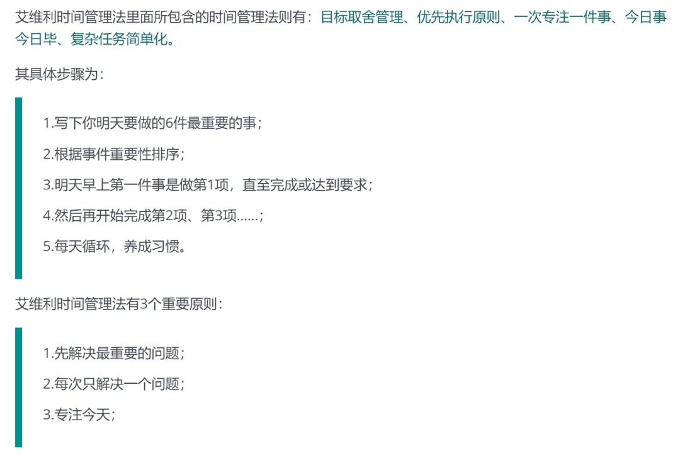

>***\*程序员健康作息表v1.0\****
>
>***\*7:\*******\*25\*******\*：起床\*******\*+喝水\****
>
>英国威斯敏斯特大学的研究人员发现，那些在早上5:22―7:21 分起床的人，其血液中有一种能引起心脏病的物质含量较高，因此，在7:21之后起床对身体健康更加有益。打开台灯。“一醒来，就将灯打开，这样将会重新调整体内的生物钟，调整睡眠和醒来模式。”
>
>近期，发表在《美国医学会杂志》子刊JAMA Network Open的一项研究，专门探讨了在中国、日本、新加坡和韩国人群中，每晚的睡眠时长与全因死亡率、心血管疾病死亡率及癌症等其它疾病死亡率之间的相关性。研究指出，每晚睡7小时的死亡风险最低。其中，年龄和性别是睡眠时长与各种疾病死亡率相关性的重要影响因素。
>
>拉夫堡大学睡眠研究中心教授吉姆·霍恩说。喝一杯水。水是身体内成千上万化学反应得以进行的必需物质。早上喝一杯清水，可以补充晚上的缺水状态。
>
> 
>
>***\*7:30―8:00：\*******\*刷牙+小卖部买早餐和酸奶[可以是自己喜欢的有益流体食物]\****
>
>“在早饭之前刷牙可以防止牙齿的腐蚀，因为刷牙之后，可以在牙齿外面涂上一层含氟的保护层。要么，就等早饭之后半小时再刷牙。”英国牙齿协会健康和安全研究人员戈登·沃特金斯说。
>
>今年6月份，一篇名为Associations of toothbrushing behaviour with risksof vascular and nonvascular diseases in Chinese adults发表在European Journal of Clinical Investigation上。该研究通过对近50万国人进行长达10年的随访调研发现：
>
>1、与经常刷牙的人相比，从不或很少刷牙的人其 主要血管事件发生风险增加了12%。 同时， 中风、脑出血和肺心病风险分别增加了8%，18%和22%。 
>
>2、经常不刷牙的人：癌症、慢性阻塞性肺病及肝硬化风险分别增加了9%、12%和25%，过早死亡风险增加25%。 从不或很少刷牙的人患心血管相关疾病的风险增加 该研究共纳入的 487198 名成年人，基线平均年龄为 51.5 岁，41% 为男性，43% 居住在城市地区。根据调研，其中9.3% 的参与者很少或从不刷牙，男性的比例高于女性（11.4% VS 7.8%），但在农村和城市地区相似（9.5% VS9.1%）。与经常刷牙的人相比，很少或从不刷牙的人更有可能是男性、年龄较大且健康生活方式不佳（例如，吸烟较多，但蔬菜和水果摄入量较少）。
>
> 
>
>***\*8:00―8:30：吃早饭\****
>
>“早饭必须吃，因为它可以帮助你维持血糖水平的稳定，”伦敦大学国王学院营养师凯文·威尔伦说。早饭可以吃燕麦粥等，这类食物具有较低的血糖指数。
>
> 
>
>***\*8:30―9:00\**** ***\*背英语单词+摄入牛奶+摄入咖啡\****
>
>避免运动，上班。来自布鲁奈尔大学的研究人员发现，在早晨进行锻炼的运动员更容易感染疾病，因为免疫系统在这个时间的功能最弱。步行上班。马萨诸塞州大学医学院的研究人员发现，每天走路的人，比那些久坐不运动的人患感冒病的几率低25%。
>
>与不食用乳制品的人相比，每天摄入两份乳制品（一份指244克牛奶/酸奶，15克奶酪或5克黄油）的人，全因死亡风险下降了17%，心血管死亡风险下降23%，中风风险下降33%
>
>在最近的荟萃分析中，该研究包括来自不同国家的40项研究和3,852,651名受试者。在这项荟萃分析显示，咖啡摄入量与各种原因的死亡率，CVD和癌症死亡率之间存在非线性关系，每天摄入两杯咖啡的癌症死亡率最低(RR = 0.96)，CVD最低的死亡率，每天2.5杯(RR= 0.83)，全天最低死亡率为每天3.5杯(RR= 0.85)，并且随着咖啡消费量的增加，死亡率没有进一步降低或增加
>
> 
>
>***\*9:\*******\*00 -- 11:00 [可以参考番茄学习法进行休息]\****  
>
>开始一天中最困难的工作。纽约睡眠中心的研究人员发现，大部分人在每天醒来的一两个小时内头脑最清醒。
>
>　　
>
>***\*11:00喝杯酸奶\**** ***\*--11:30 完成算法题之后可以选择吃饭\****
>
>这样做可以稳定血糖水平。在每天三餐之间喝些酸牛奶，有利于心脏健康。你可以在吃早饭时，多带一份酸奶上班。
>
> 
>
>***\*11\*******\*:\*******\*30\**** ***\*--\**** ***\*12:00\**** ***\*午餐\****
>
>多吃豆类蔬菜。你需要一顿可口的午餐，并且能够缓慢地释放能量。“烘烤的豆类食品富含纤维素，番茄酱可以当作是蔬菜的一部分。”维伦博士说。
>
> 
>
>***\*12:30―13:00\**** ***\*午休\****
>
>午休一小会儿。雅典的一所大学研究发现，那些每天中午午休30分钟或更长时间，每周至少午休3次的人，因心脏病死亡的几率会下降37%。
>
> 
>
>***\*13:00 -16:00 学校课程学习 [可以参考番茄学习法进行休息]\****  
>
> 
>
>***\*16:00：喝杯酸奶。同早上11点\****
>
> 
>
>***\*16:00-17:00 完成算法题后可以选择吃饭\****
>
>***\*17:00―19:00：锻炼身体\****
>
>根据体内的生物钟，这个时间是运动的最佳时间，舍菲尔德大学运动学医生瑞沃·尼克说。
>
>***\*17:30：晚餐少吃点\****
>
>晚饭吃太多，会引起血糖升高，并增加消化系统的负担，影响睡眠。晚饭应该多吃蔬菜，少吃富含卡路里和蛋白质的食物。吃饭时要细嚼慢咽。
>
>***\*2\*******\*1\*******\*:00：洗个热水澡\****
>
>“体温的适当降低有助于放松和睡眠。”拉夫堡大学睡眠研究中心吉姆·霍恩教授说
>
>近日，发表在《Heart》杂志上的一项长期研究表明，经常洗澡可以降低死于心脏病和中风的风险。研究表明，“频率”越高，对心血管的保护越好，每天洗一次热水澡似乎比每周洗一两次更具保护作用。
>
>之前已有研究证明了盆浴暴露的热量是预防CVD的潜在手段。热暴露对[糖尿病](http://study.cn-healthcare.com/collegewap/299)控制的影响最早是从1998年发表的一份报告中提出的，该报告要求八名2型糖尿病参与者每天在浴缸中洗澡30分钟，每周6天，共3周，结果发现，参与者的平均空腹血糖降低了20％，平均糖基化血红蛋白降低了10％。后来的前瞻性研究还报道了其对血压和体重控制的进一步影响。但它对心血管疾病风险的长期影响，包括心脏病发作、心源性猝死和中风，至今仍然是未解之谜
>
> 
>
>***\*21:\*******\*00-22:00\*******\*：看会电视或听音乐\****
>
>这个时间看会儿电视或听音乐放松一下，有助于睡眠，但要注意，尽量不要躺在床上看电视，这会影响睡眠质量。
>
>***\*11：00 刷牙\****
>
>***\*11：55\*******\*：上床睡觉\****
>
>如果你早上7点25起床，现在入睡可以保证你享受7小时30分钟的睡眠。
>
>加拿大麦克马斯特大学人口健康研究所SalimYusuf 教授联合中国医学科学院阜外医院的研究团队做了一项研究，发表在《Sleep Medicine》杂志上，涉及21个国家中的 112198 例参与者数据，前瞻性随访9.2 年，并将观察对象划分为早睡组（晚上10点前就寝），正常睡眠组（晚上10点-12 点），晚睡组（晚上12点后），然后探究每个小组关于全因死亡、非致死性心梗、卒中和心衰等各种风险。
>	其中一个结论为，就寝时间与全因死亡率的关联性强，过早睡觉和过晚睡觉都会影响健康，但是早睡增加的全因死亡率比晚睡增加的死亡率高，早睡增加了43%的死亡风险，而晚睡增加了15%的死亡风险。
>	综合全部分析，研究者认为：过早（晚上10点前）或过晚（晚上12 点后）就寝，都会增加全因死亡和主要心血管不良事件的复合发生风险，建议在晚间 10-12 点间上床睡觉。
>
> 
>
>***\*行动参考：\****[***\*https://github.com/geekan/HowToLiveLonger\****](https://github.com/geekan/HowToLiveLonger)
>
>##### ***\*基于艾维利时间管理法\****
>
>了解艾维利时间管理法前，我们先看一个故事。
>
>美国伯利恒钢铁公司总裁曾因为公司濒临破产，而向效率大师艾维利咨询求助。
>
>30分钟的交流中，前20分钟艾维利耐心地听完其焦头烂额的倾诉，最后请他拿出一张白纸，并让他写下第二天他要做的全部事情。几分钟后，白纸上满满记录了总裁先生28项要做的工作。
>
>此时，艾维利请他仔细考量，并要求他按事情的重要顺序，分别从“1”到“6”标出***\*六件\****最重要的事情。同时告诉他，请他从明天开始，且每天都这样做：“每天一开始，请你全力以赴做好标号为‘1’的事情，直到它被完成或被完全准备好，然后再全力以赴的做标号为‘2’的事，依次类推……” 。
>
>艾维利认为，如果一个人每天都能全力以赴的完成六件最重要的事，那么他一定是高效使用时间的成功人士。
>
>一年后，作为此次咨询的报酬，艾维利收到了来自伯利恒公司的巨额支票。
>
>五年后，伯利恒钢铁公司已成为当时全美最大的私营钢铁公司，该时间管理法就此成名。
>
>